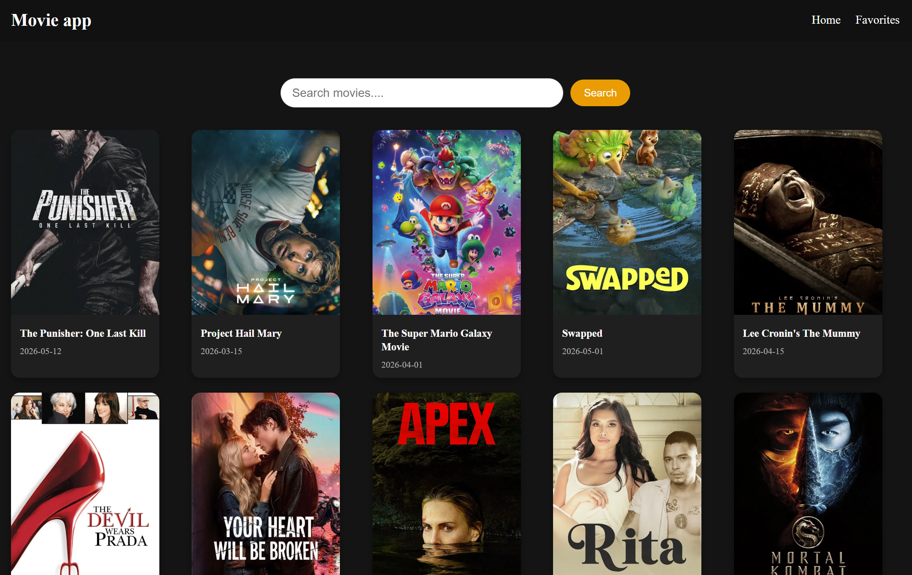
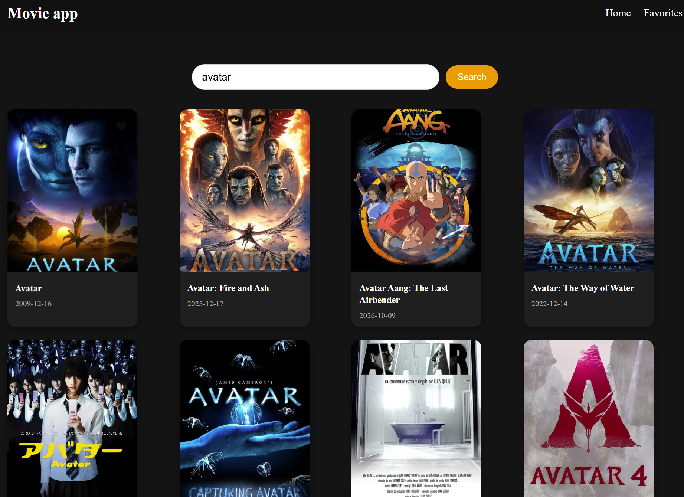
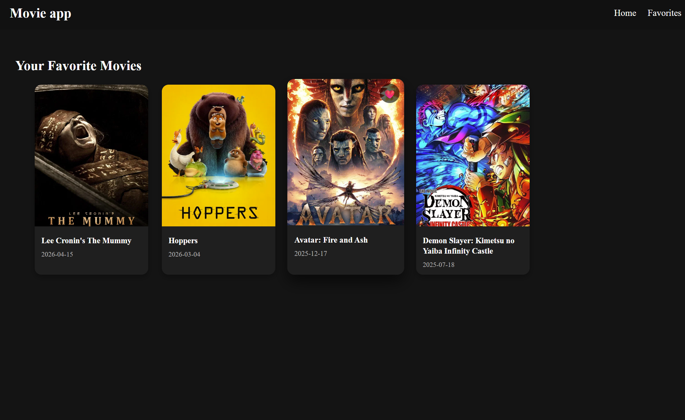
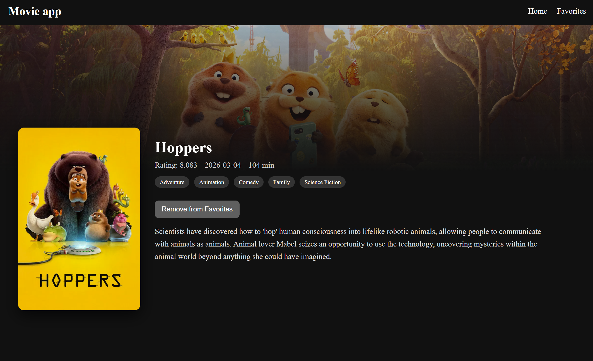

# Movie App / 映画アプリ

## English

### Overview
A movie search web application built with React and TypeScript.

### Features
- Movie search
- Movie details display
- Favorite movie feature
- Responsive UI

### Technologies Used
- React
- TypeScript
- Vite
- Movie API

### What I Learned
- API integration
- React component structure
- State management
- Asynchronous data fetching
- Managing favorite items with state

---

## 日本語

### 概要
ReactとTypeScriptを使用して開発した映画検索アプリです。

### 主な機能
- 映画検索
- 映画詳細表示
- お気に入り機能
- レスポンシブ対応

### 使用技術
- React
- TypeScript
- Vite
- 映画API

### 学んだこと
- API連携
- Reactのコンポーネント設計
- 状態管理
- 非同期処理
- お気に入り機能の実装

---

## Screenshot
### Home Page



### Searching



### Favorites Page



### Move-details Page



---

## Run Locally

### Prerequisites
- Node.js v18+
- npm

### Setup

1. Clone the repository

```bash
git clone https://github.com/HanKwan/Movie-app-react
cd movie-app
```

2. Install dependencies

```bash
npm install
```

3. Create a `.env` file in the project root

```env
VITE_TMDB_API_KEY=your_api_key_here
```

4. Start the development server

```bash
npm run dev
```